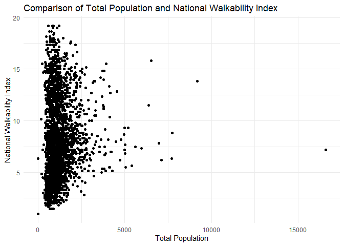
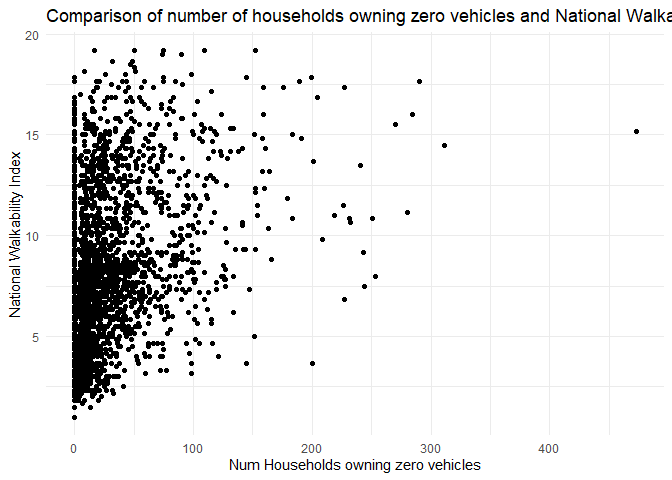
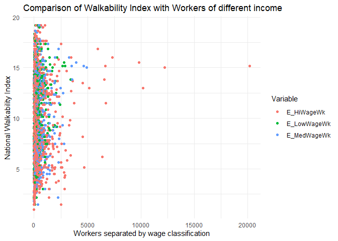
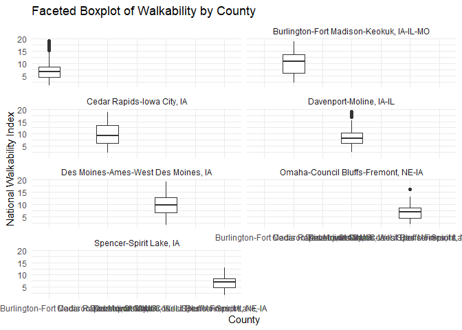
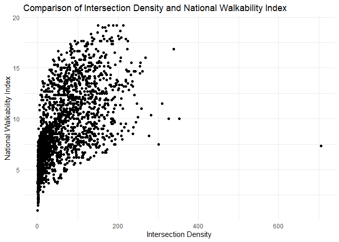
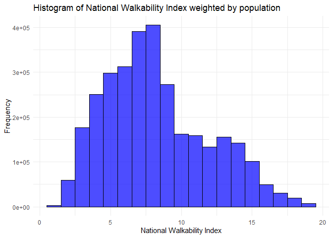

Keegan Ds2020 Final
================
Keegan Moerke
2024-12-13

## Abstract

The goal of this project is to find trends in the walkability of cities
in Iowa. Walkability is a key indicator of how well cities are planned
and of the quality of life in that area. I chose to limit my project to
just Iowa because the initial dataset was simply too large and Iowa is
of relevance to all of us. Iowa also has plenty of rural and urban areas
to show the difference.

``` r
library(ggplot2)
```

    ## Warning: package 'ggplot2' was built under R version 4.4.2

This is the fullset, it is too big for github and to analyze, so I
restrict it to only include Iowa and write it to another csv later.

``` r
df <-  read.csv("EPA_SmartLocationDatabase_V3_Jan_2021_Final.csv")

head(df)
```

    ##   OBJECTID    GEOID10    GEOID20 STATEFP COUNTYFP TRACTCE BLKGRPCE CSA
    ## 1        1 4.8113e+11 4.8113e+11      48      113    7825        4 206
    ## 2        2 4.8113e+11 4.8113e+11      48      113    7825        2 206
    ## 3        3 4.8113e+11 4.8113e+11      48      113    7825        3 206
    ## 4        4 4.8113e+11 4.8113e+11      48      113    7824        1 206
    ## 5        5 4.8113e+11 4.8113e+11      48      113    7824        2 206
    ## 6        6 4.8113e+11 4.8113e+11      48      113    7827        1 206
    ##                   CSA_Name  CBSA                       CBSA_Name CBSA_POP
    ## 1 Dallas-Fort Worth, TX-OK 19100 Dallas-Fort Worth-Arlington, TX  7189384
    ## 2 Dallas-Fort Worth, TX-OK 19100 Dallas-Fort Worth-Arlington, TX  7189384
    ## 3 Dallas-Fort Worth, TX-OK 19100 Dallas-Fort Worth-Arlington, TX  7189384
    ## 4 Dallas-Fort Worth, TX-OK 19100 Dallas-Fort Worth-Arlington, TX  7189384
    ## 5 Dallas-Fort Worth, TX-OK 19100 Dallas-Fort Worth-Arlington, TX  7189384
    ## 6 Dallas-Fort Worth, TX-OK 19100 Dallas-Fort Worth-Arlington, TX  7189384
    ##   CBSA_EMP CBSA_WRK  Ac_Total Ac_Water   Ac_Land   Ac_Unpr TotPop CountHU  HH
    ## 1  3545715  3364458  73.59503        0  73.59503  73.59503   1202     460 423
    ## 2  3545715  3364458 119.82991        0 119.82991 119.21420    710     409 409
    ## 3  3545715  3364458  26.36705        0  26.36705  26.36705    737     365 329
    ## 4  3545715  3364458 119.06069        0 119.06069 119.06069    904     384 384
    ## 5  3545715  3364458 169.92721        0 169.92721 148.74292    948     343 343
    ## 6  3545715  3364458  50.68713        0  50.68713  50.68713   1336     556 497
    ##   P_WrkAge AutoOwn0    Pct_AO0 AutoOwn1    Pct_AO1 AutoOwn2p  Pct_AO2p Workers
    ## 1    0.549       69 0.16312057       39 0.09219858       315 0.7446809     412
    ## 2    0.466        0 0.00000000      168 0.41075795       241 0.5892421     395
    ## 3    0.811       19 0.05775076      143 0.43465046       167 0.5075988     463
    ## 4    0.638        0 0.00000000       43 0.11197917       341 0.8880208     431
    ## 5    0.506        5 0.01457726       67 0.19533528       271 0.7900875     579
    ## 6    0.588       33 0.06639839      351 0.70623742       113 0.2273642     586
    ##   R_LowWageWk R_MedWageWk R_HiWageWk R_PCTLOWWAGE TotEmp E5_Ret E5_Off E5_Ind
    ## 1          99         122        191    0.2402913     66     20      3      0
    ## 2          76         107        212    0.1924051     25      7      0      3
    ## 3         136         189        138    0.2937365      0      0      0      0
    ## 4          60          69        302    0.1392111    253     26      0     25
    ## 5          91          84        404    0.1571675     32      0      2     10
    ## 6         143         237        206    0.2440273      3      0      1      0
    ##   E5_Svc E5_Ent E8_Ret E8_off E8_Ind E8_Svc E8_Ent E8_Ed E8_Hlth E8_Pub
    ## 1     19     24     20      3      0     15     24     0       4      0
    ## 2     15      0      7      0      3     13      0     0       2      0
    ## 3      0      0      0      0      0      0      0     0       0      0
    ## 4     47    155     26      0     25      3    155     2      42      0
    ## 5     20      0      0      2     10     19      0     0       1      0
    ## 6      2      0      0      1      0      2      0     0       0      0
    ##   E_LowWageWk E_MedWageWk E_HiWageWk E_PctLowWage       D1A       D1B
    ## 1          21          27         18    0.3181818  6.250422 16.332625
    ## 2          10           4         11    0.4000000  3.430799  5.955666
    ## 3           0           0          0    0.0000000 13.843035 27.951553
    ## 4         121          87         45    0.4782609  3.225246  7.592767
    ## 5           6           9         17    0.1875000  2.305992  6.373413
    ## 6           2           1          0    0.6666667 10.969254 26.357776
    ##          D1C   D1C5_RET   D1C5_OFF   D1C5_IND   D1C5_SVC D1C5_ENT   D1C8_RET
    ## 1 0.89679971 0.27175749 0.04076362 0.00000000 0.25816961 0.326109 0.27175749
    ## 2 0.20970656 0.05871784 0.00000000 0.02516479 0.12582394 0.000000 0.05871784
    ## 3 0.00000000 0.00000000 0.00000000 0.00000000 0.00000000 0.000000 0.00000000
    ## 4 2.12496674 0.21837603 0.00000000 0.20997695 0.39475667 1.301857 0.21837603
    ## 5 0.21513629 0.00000000 0.01344602 0.06723009 0.13446018 0.000000 0.00000000
    ## 6 0.05918662 0.00000000 0.01972887 0.00000000 0.03945775 0.000000 0.00000000
    ##     D1C8_OFF   D1C8_IND   D1C8_SVC D1C8_ENT    D1C8_ED   D1C8_HLTH D1C8_PUB
    ## 1 0.04076362 0.00000000 0.20381811 0.326109 0.00000000 0.054351497        0
    ## 2 0.00000000 0.02516479 0.10904741 0.000000 0.00000000 0.016776525        0
    ## 3 0.00000000 0.00000000 0.00000000 0.000000 0.00000000 0.000000000        0
    ## 4 0.00000000 0.20997695 0.02519723 1.301857 0.01679816 0.352761277        0
    ## 5 0.01344602 0.06723009 0.12773717 0.000000 0.00000000 0.006723009        0
    ## 6 0.01972887 0.00000000 0.03945775 0.000000 0.00000000 0.000000000        0
    ##         D1D D1_FLAG    D2A_JPHH D2B_E5MIX D2B_E5MIXA D2B_E8MIX D2B_E8MIXA
    ## 1  7.147222       0 0.156028369 0.8862639  0.7633862 0.8554418  0.6620914
    ## 2  3.640506       0 0.061124694 0.8350147  0.5699862 0.8316863  0.5544576
    ## 3 13.843035       0 0.000000000 0.0000000  0.0000000 0.0000000  0.0000000
    ## 4  5.350213       0 0.658854167 0.7757403  0.6681863 0.6427537  0.5538314
    ## 5  2.521128       0 0.093294461 0.7559752  0.5160334 0.6885953  0.4590635
    ## 6 11.028441       0 0.006036217 0.9182958  0.3954885 0.9182958  0.3060986
    ##    D2A_EPHHM D2C_TRPMX1 D2C_TRPMX2  D2C_TRIPEQ  D2R_JOBPOP D2R_WRKEMP
    ## 1 0.34891160 0.52629580 0.58591604 0.287128311 0.104100946 0.27615063
    ## 2 0.19704732 0.24848111 0.27130932 0.002032680 0.068027211 0.11904762
    ## 3 0.00000000 0.00000000 0.00000000 0.367879441 0.000000000 1.00000000
    ## 4 0.68282982 0.62071857 0.67794263 0.596350980 0.437337943 0.73976608
    ## 5 0.26147198 0.24773530 0.25898628 0.007902649 0.065306122 0.10474632
    ## 6 0.03686198 0.03688739 0.04106609 0.000000000 0.004480956 0.01018676
    ##   D2A_WRKEMP   D2C_WREMLX      D3A      D3AAO     D3AMM     D3APO        D3B
    ## 1   6.242424 5.287423e-03 23.53490  0.0000000 10.655277 12.879623 115.981747
    ## 2  15.800000 3.736300e-07 22.89337  0.7551371  2.859482 19.278747  80.145600
    ## 3   0.000000 0.000000e+00 14.21051  6.1283653  2.611430  5.470714  24.272717
    ## 4   1.703557 4.948219e-01 32.17837  2.2085936  9.323547 20.646233 141.604424
    ## 5  18.093750 3.769460e-08 22.05865  2.2896592  3.176070 16.592921  65.307963
    ## 6 195.333333 0.000000e+00 23.21342 15.0347553  6.401238  1.777430   8.421862
    ##       D3BAO   D3BMM3    D3BMM4    D3BPO3    D3BPO4    D4A D4B025      D4B050
    ## 1  0.000000 60.87368  8.696240  34.78496 43.481198 362.10      0 0.000000000
    ## 2  5.340904 10.68181 10.681807  85.45446  5.340904 718.84      0 0.009516414
    ## 3 24.272717  0.00000 24.272717   0.00000  0.000000 398.31      0 0.000000000
    ## 4 21.501640 21.50164 32.252460 134.38525  5.375410 386.24      0 0.515376911
    ## 5  3.766319  0.00000  7.532637  75.32637  7.532637 638.37      0 0.248922255
    ## 6 50.505919 12.62648  0.000000   0.00000  0.000000 950.85      0 0.094844428
    ##    D4C      D4D         D4E   D5AR   D5AE   D5BR  D5BE        D5CR     D5CRI
    ## 1 4.33 37.65472 0.003602329 433601 303660 135362 53504 0.000397944 0.7858935
    ## 2 4.33 23.12611 0.006098592 386504 272135 236885 90089 0.000354720 0.7005311
    ## 3 3.00 72.81815 0.004070556 404573 288925 230587 82815 0.000371303 0.7332808
    ## 4 6.67 35.85398 0.007378319 423099 298058 168433 79657 0.000388306 0.7668588
    ## 5 6.67 25.12134 0.007035865 335700 238166 120826 48682 0.000308094 0.6084498
    ## 6 3.00 37.87944 0.002245509 402287 289607 138562 52583 0.000369205 0.7291374
    ##          D5CE     D5CEI        D5DR     D5DRI        D5DE     D5DEI D2A_Ranked
    ## 1 0.000357645 0.8412986 0.000525075 0.1846967 0.000475598 0.1377067          6
    ## 2 0.000320516 0.7539577 0.000918888 0.3232213 0.000800804 0.2318678          3
    ## 3 0.000340291 0.8004749 0.000894457 0.3146279 0.000736145 0.2131463          1
    ## 4 0.000351047 0.8257781 0.000653359 0.2298209 0.000708073 0.2050183         16
    ## 5 0.000280508 0.6598456 0.000468689 0.1648628 0.000432736 0.1252960          4
    ## 6 0.000341094 0.8023644 0.000537488 0.1890630 0.000467412 0.1353362          1
    ##   D2B_Ranked D3B_Ranked D4A_Ranked NatWalkInd Shape_Length Shape_Area
    ## 1         14         15         17  14.000000     3110.361   297836.1
    ## 2         10         12         14  10.833333     3519.469   484945.1
    ## 3          1          7         17   8.333333     1697.092   106705.9
    ## 4         10         17         17  15.666667     2922.609   481828.4
    ## 5          7         11         14  10.166667     3731.972   687684.8
    ## 6          4          5         13   6.833333     3109.652   205126.8

Below shows restricting the data to just Iowa, then several plots
comparing variables to walkability.

``` r
 # This will install ggplot2 and other useful packages
library(tidyverse)
```

    ## ── Attaching core tidyverse packages ──────────────────────── tidyverse 2.0.0 ──
    ## ✔ dplyr     1.1.4     ✔ readr     2.1.5
    ## ✔ forcats   1.0.0     ✔ stringr   1.5.1
    ## ✔ lubridate 1.9.3     ✔ tibble    3.2.1
    ## ✔ purrr     1.0.2     ✔ tidyr     1.3.1
    ## ── Conflicts ────────────────────────────────────────── tidyverse_conflicts() ──
    ## ✖ dplyr::filter() masks stats::filter()
    ## ✖ dplyr::lag()    masks stats::lag()
    ## ℹ Use the conflicted package (<http://conflicted.r-lib.org/>) to force all conflicts to become errors

``` r
iowa_df = subset(df, `STATEFP` == 19)
# Assuming df is your dataframe
ggplot(data = iowa_df, aes(x = TotPop, y = NatWalkInd)) +
  geom_point() +
  labs(title = "Comparison of Total Population and National Walkability Index",
       x = "Total Population",
       y = "National Walkability Index") +
  theme_minimal()
```

<!-- -->

``` r
ggplot(data = iowa_df, aes(x = AutoOwn0, y = NatWalkInd)) +
  geom_point() +
  labs(title = "Comparison of number of households owning zero vehicles and National Walkability Index",
       x = "Num Households owning zero vehicles",
       y = "National Walkability Index") +
  theme_minimal()
```

<!-- -->

``` r
# Convert data from wide to long format
long_df <- iowa_df %>%
  pivot_longer(cols = c(E_LowWageWk, E_MedWageWk, E_HiWageWk), names_to = "Variable", values_to = "Value")

# Plot the reshaped data
ggplot(data = long_df, aes(x = Value, y = NatWalkInd, color = Variable)) +
  geom_point() +
  labs(title = "Comparison of Walkability Index with Workers of different income",
       x = "Workers separated by wage classification",
       y = "National Walkability Index",
       color = "Variable") +
  theme_minimal()
```

<!-- --> The
first plot just shows population of a block to its walkability index.
There is not really any correlation.

The second plot compares the number of households that own zero cars to
the walkability index. This shows that there is some correlation. In the
block with the most households without cars have fairly high
walkability.

The third plot attempts to find if there is a correlation between
walkability and the income of its residents. This shows that the more
walkable blocks have higher income residents.

``` r
# Writing the dataframe to a CSV file
write.csv(iowa_df, file = "iowa_walkability_data.csv", row.names = FALSE)
```

``` r
# Assuming 'iowa_df' is your dataframe and it has columns 'COUNTYFP' and 'NatWalkInd'
ggplot(data = iowa_df, aes(x = factor(CSA_Name), y = NatWalkInd)) +
  geom_boxplot() +
  labs(title = "Faceted Boxplot of Walkability by County",
       x = "County",
       y = "National Walkability Index") +
  facet_wrap(~ CSA_Name, nrow = 4) +
  theme_minimal()
```

<!-- --> -This
plot compares intersection density to walkability score

``` r
library(ggplot2)
ggplot(data = iowa_df, aes(x = D3B, y = NatWalkInd)) +
  geom_point() +
  labs(title = "Comparison of Intersection Density and National Walkability Index",
       x = "Intersection Density",
       y = "National Walkability Index") +
  theme_minimal()
```

<!-- --> -This
plot compares intersection density to walkability score

``` r
library(ggplot2)
# Histogram of National Walkability Index
ggplot(data = iowa_df, aes(x = NatWalkInd, weight = TotPop)) +
  geom_histogram(binwidth = 1, fill = "blue", color = "black", alpha = 0.7) +
  labs(title = "Histogram of National Walkability Index weighted by population",
       x = "National Walkability Index",
       y = "Frequency") +
  theme_minimal()
```

<!-- --> -This
plot shows distribution of each block by its walkability indexs weighted
by population
